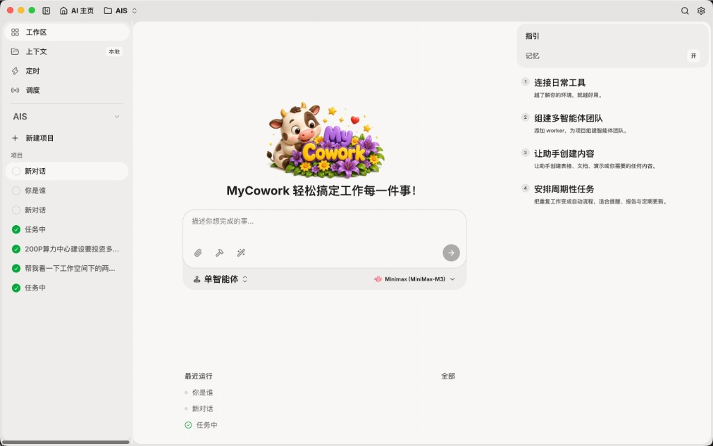
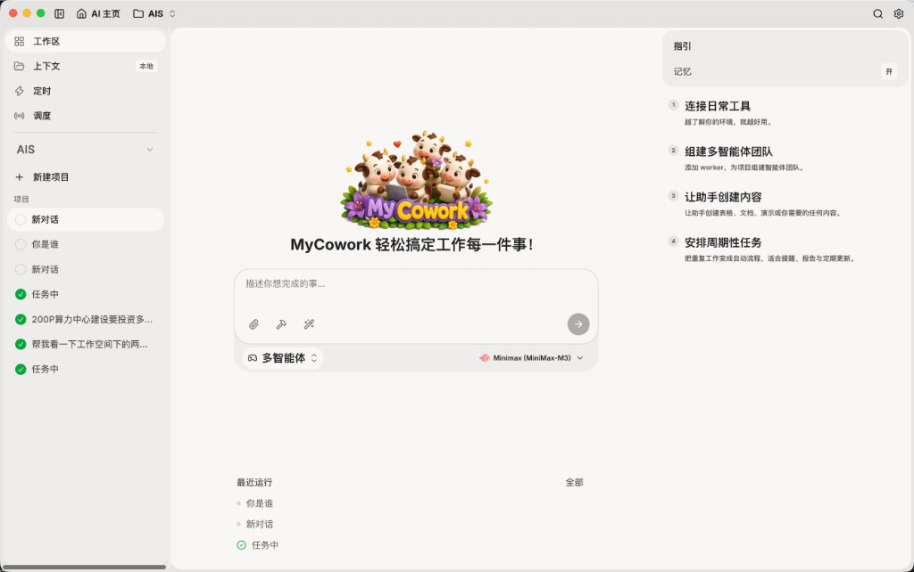
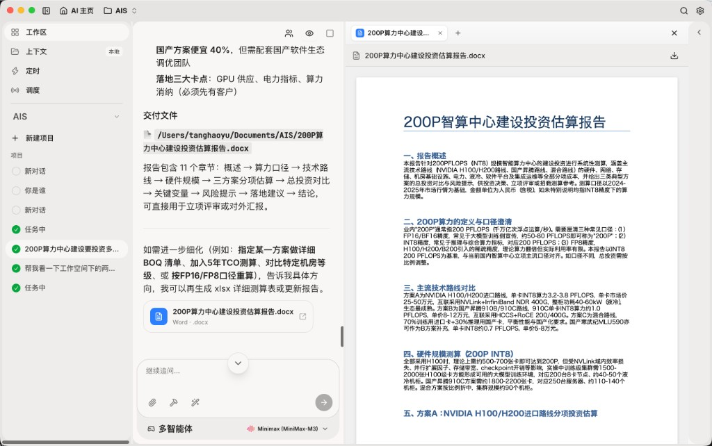
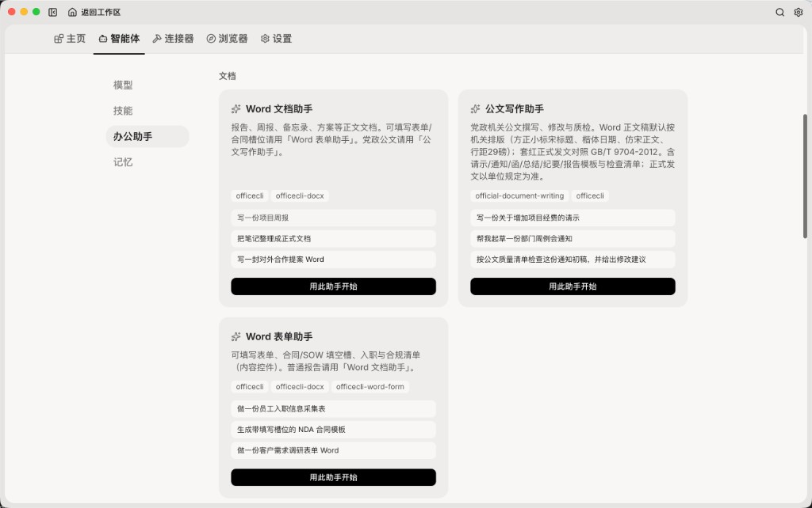
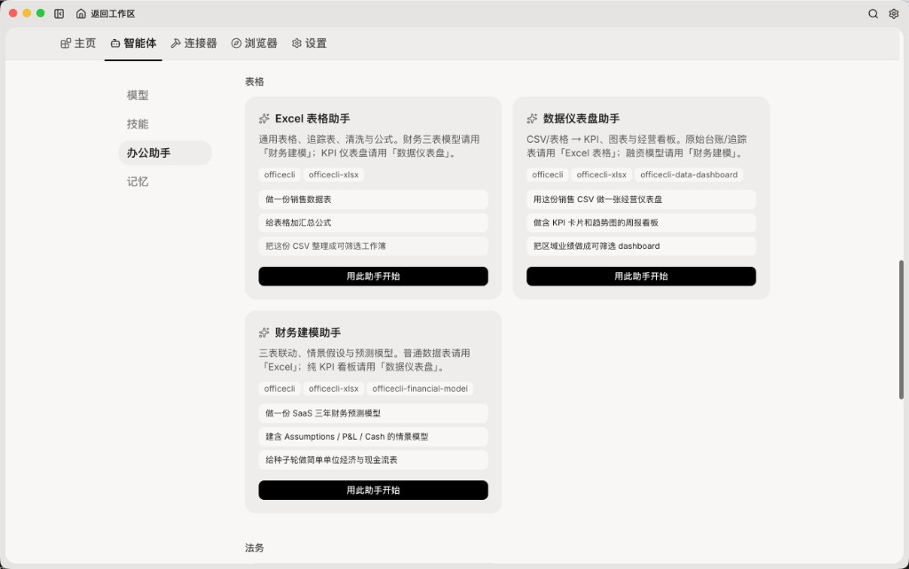
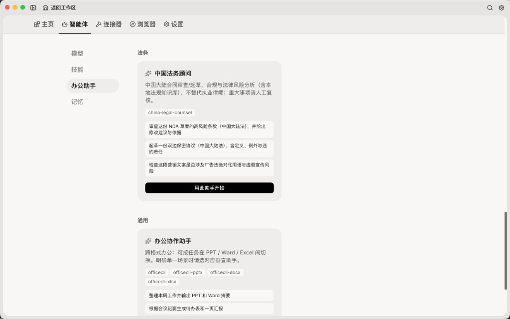
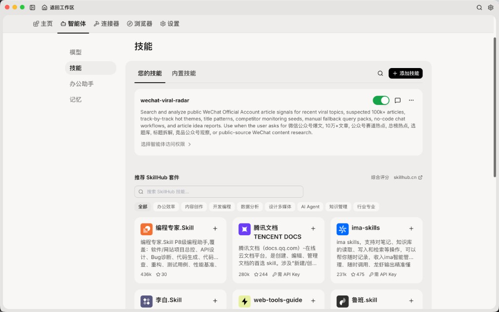
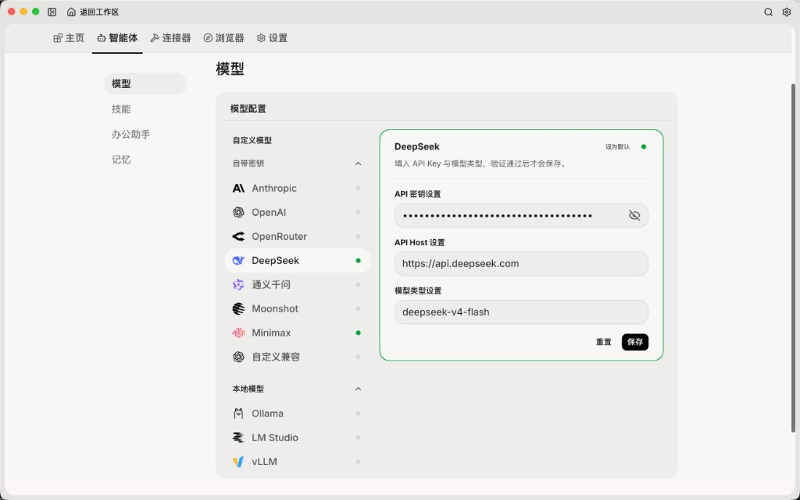

<p align="center">


</p>

<h1 align="center">MyCowork</h1>

<p align="center">
  <strong>本机办公数字员工</strong> · 对话即交付 Word / Excel / PPT / 公文<br />
  单机胖客户端 · 本地优先 · 自带密钥 · 单智能体 / 多智能体
</p>

<p align="center">
  Electron · React · FastAPI · LangGraph · OfficeCLI
</p>

<p align="center">
  <strong>中文</strong> · <a href="./README.en.md">English</a>
</p>

MyCowork 是跑在你自己电脑上的办公 Agent：描述任务，助手直接读写本机工作区、生成可打开的文档，并在同一窗口里预览。对标 Claude Cowork / WorkBuddy 一类「数字员工」，但模型、文件和密钥都留在本机，各成员独立部署、互不共享。

---

## 界面一览

单智能体主页：一只牛同事，适合直接交代一件事。



多智能体主页：一整个牛团队，适合拆解、并行、多格式一起交付。



工作区：对话、任务列表、交付文件卡片和右侧文档预览同一屏完成。



---

## 它能做什么

- **本机落盘**：产物写到你的工作区（默认如 `~/Documents/AIS`），不是云端草稿。过程发现记在笔记里；侧栏只展示写文件工具和终稿路径，不碰工作区外的东西。
- **两种执行模式**
  - **单智能体**：一个 ReAct Agent 走完全程，轻量、适合单一文档或问答。
  - **多智能体（Workforce）**：Planner 拆任务 → 你确认子任务 → Coordinator 按依赖并行委派文档 / 浏览 / 开发工人，失败可重规划。
- **办公助手目录**：按场景预加载 Skill，一键开始写周报、公文、表单、仪表盘、财务模型或合同审查。
- **Skills + SkillHub**：本机技能可开关、可授权给指定智能体；也可从 SkillHub 浏览、安装套件。
- **自带模型面板**：Anthropic / OpenAI / OpenRouter / DeepSeek / 通义 / Moonshot / MiniMax，以及 Ollama、LM Studio、vLLM 本地模型。Key 存在系统钥匙串，校验通过才保存。
- **连接器与浏览器**：MCP 连接日常工具；内置浏览器自动化（Playwright MCP，按需安装 Chromium）。
- **记忆、定时、调度**：长期记忆写入本机 SQLite；带 `schedule` 的 Skill 由本机 APScheduler 触发（应用保持运行才会执行）。
- **可选远程入口**：飞书机器人经 Cloudflare Tunnel 把本机 `/webhook/lark` 暴露为 HTTPS（关机则不可达）。

### 办公助手



| 分类 | 助手 | 典型产出 |
| --- | --- | --- |
| 演示文稿 | PPT 演示助手、路演 PPT 助手 | `.pptx` 汇报 / 融资 deck |
| 文档 | Word 文档助手、公文写作助手、Word 表单助手 | 周报、请示/通知、可填写表单 |
| 表格 | Excel 表格助手、数据仪表盘助手、财务建模助手 | 台账、KPI 看板、三表模型 |
| 法务 | 中国法务顾问 | 合同审查 / 起草（含大陆法规知识库） |
| 通用 | 办公协作助手 | 同一任务在 PPT / Word / Excel 间切换 |

公文写作按机关常用稿面（标题、正文字体、行距等）排版，套红发文对照 GB/T 9704-2012。法务与公文均为**辅助撰写 / 质检**，不构成正式发文或法律意见。





文档生成优先走捆绑的 [OfficeCLI](https://github.com/iOfficeAI/OfficeCLI) 二进制（`officecli`），本机预览同样走 OfficeCLI watch；不可用时再降级到内置 `docx_gen` / `xlsx_gen` / `pptx_gen` 和简易预览。

### 技能与模型

本机技能可开关，SkillHub 按办公效率、内容创作、开发、数据、设计、知识管理等分类推荐套件。



模型页支持云厂商与本地推理；OpenRouter / Ollama 等在注入后端时归一为 OpenAI 兼容协议。



---

## 架构

单机胖客户端：Electron 启动时拉起本机 Python（FastAPI），渲染进程用 localhost HTTP + SSE 对话和看 Trace。工具调用都在本机进程内完成，没有「远端再回调本机」的 WebSocket。

```
┌────────────────────────── 用户本机 ──────────────────────────┐
│  Electron 渲染进程 (React)                                   │
│   对话 / 工作区 / 助手 / Skills / 模型 / 确认弹窗              │
│                         │ HTTP + SSE                         │
│  Electron 主进程 (Node)                                      │
│   spawn 后端 · Keychain · PDF printToPDF · 文件对话框          │
│                         │ localhost                          │
│  Python (FastAPI + LangGraph)                                │
│   编排 → Graph（单智能体 / Workforce）→ 工具 / MCP / Skills    │
│   SQLite + sqlite-vec · APScheduler · 飞书 webhook            │
└──────────────────────────────────────────────────────────────┘
         可选：Cloudflare Tunnel → 飞书事件订阅
```

后端按 harness 九层划分，跨层依赖只允许向下（`import-linter` 在 CI 里卡）：

| 层 | 目录 | 职责 |
| --- | --- | --- |
| L9 入口 | `backend/app/server/` | HTTP / SSE / webhook / 定时触发 |
| L8 编排 | `orchestrator/` | 任务生命周期、会话 |
| L7 执行 | `graphs/` `agents/` `runtime/` | LangGraph、checkpoint、预算闸 |
| L6 记忆 | `memory/` | 短期上下文 + 长期向量记忆 |
| L5 可观测 | `observability/` | Trace、日志脱敏、用量 |
| L4 护栏 | `guardrails/` | 审批门、高危命令拒单、审计 |
| L3 工具 | `tools/` | fs / exec / 文档 / MCP / Skills |
| L2 模型 | `llm/` | Provider 网关、token 计数 |
| L1 沙箱 | `sandbox/` | 路径白名单、出网策略 |

密钥不写进 `config.toml`：Electron 用系统钥匙串（macOS Keychain / Windows Credential Manager）保管，启动 Python 时注入环境变量。

---

## 技术栈

| 部分 | 选型 |
| --- | --- |
| 桌面壳 | Electron 35、electron-builder（dmg / NSIS） |
| UI | React 19、Vite、TypeScript、Tailwind、Radix、Zustand |
| 后端 | Python 3.11、FastAPI、Uvicorn、uv |
| Agent | LangGraph Supervisor / Workforce、LangChain 模型适配 |
| 办公文档 | OfficeCLI + python-docx / python-pptx / openpyxl |
| 数据 | SQLite、sqlite-vec |
| 远程 | lark-oapi、Cloudflare Tunnel（可选） |

---

## 快速开始

### 环境

- Node.js 20+
- Python 3.11+ 与 [uv](https://docs.astral.sh/uv/)
- macOS 或 Windows

### 开发模式

```bash
cd backend && uv sync
cd .. && npm install

# 如需办公文档高保真生成 / 预览
npm run fetch:officecli

npm run dev
```

`npm run dev` 会同时拉起 Vite（`127.0.0.1:5174`）、TypeScript watch 和 Electron。

分开跑也可以：

```bash
npm run dev:renderer
cd backend && uv run uvicorn app.main:app --port 8765
npm run dev:electron
```

首次使用：打开 **智能体 → 模型**，选厂商、填 API Key 与模型 ID，点保存（校验通过才会写入）。标题栏显示后端已连接后即可对话。

烟雾测试：

> 在桌面写 hello.txt，内容 hi

允许写盘确认后，桌面应出现该文件。

### 测试

```bash
cd backend && PYTHONPATH=. uv run pytest -q
cd backend && PYTHONPATH=. uv run lint-imports
npm test
npm run test:e2e    # 需先 npm run build
```

### 安装包

发布产物见 GitHub Actions（`.github/workflows/build.yml`）：

- macOS：`MyCowork-*.dmg`
- Windows：`MyCowork Setup *.exe`（NSIS，未签名时 SmartScreen 可能提示）

云端打包走 GitHub Actions（`.github/workflows/build.yml`），**不替代**本地 `package:win`：

```bash
npm run package:ci              # 推当前分支，云端打包并发布 GitHub Release（用 package.json 版本）
npm run package:ci -- --watch   # 同上，并等待跑完
npm run package:ci -- --dry-run # 只预览，不推送
```

安装包在对应 run 的 Artifacts，也会挂到 `v{version}` 的 GitHub Release（已有同名 Release 则更新资产）。push / PR 不会发 Release。

用新版本号打 tag 发版：

```bash
npm run release -- --dry-run    # 只预览，不推送
npm run release                 # 用当前 package.json 版本打 tag 并推送
npm run release -- --patch      # 0.0.4 -> 0.0.5 后打 tag 并推送
npm run release -- 0.0.5        # 指定版本
```

`package:ci` 需要已安装并登录 [GitHub CLI](https://cli.github.com/)（`gh auth login`）。`release` 只需能 `git push`。工作区必须干净。

本地打包（Windows 推荐一键脚本）：

```powershell
npm run package:win          # 智能跳过已有 python_runtime / prebuilt / officecli，只重打前端+安装包
npm run package:win:full     # 全量重建（Python + 终端环境 + 安装包，耗时长）
# 或直接：powershell -ExecutionPolicy Bypass -File scripts/build-windows.ps1
```

macOS / 手动分步：

```bash
npm run build:python:mac
bash scripts/build-electron.sh --mac
# Windows 分步：npm run build:python:windows && npx electron-builder --config build/electron-builder.yml --win
```

macOS Gatekeeper 若拦截：系统设置 → 隐私与安全性 → 仍要打开，或：

```bash
xattr -dr com.apple.quarantine /Applications/MyCowork.app
```

更完整的安装与飞书远程步骤见 [docs/部署手册.md](docs/部署手册.md)。

---

## 使用说明

1. **工作区**：左侧选项目 / 会话；中间对话；右侧预览交付的 `.docx` / `.pptx` / `.xlsx`。
2. **智能体**
   - 模型：配置云或本地 LLM，可设默认。
   - 技能：开关本机 Skill，给智能体授权，或从 SkillHub 安装。
   - 办公助手：按场景开始，会预加载对应 Skill 并把推荐提问填进输入框。
   - 记忆：可开关；「记住 …」会写入 `~/.my-cowork/memory.db`。
3. **连接器**：MCP Server。也可编辑 `~/.my-cowork/mcp.json`，或从 `config.template.toml` 复制为 `config.toml`。
4. **确认闸门**：写文件、执行命令、生成文档会弹窗。请核对路径后再允许。同一次任务里后续 `officecli` 调用可自动放行。
5. **定时**：Skill 的 `skill.yaml` 里写 `schedule` 即可注册；客户端需保持运行。

添加 Skill 的约定见 [docs/开发指南.md](docs/开发指南.md) 与 [skills/README.md](skills/README.md)。

---

## 安全边界

- **本地优先、单租户**：不做云托管、多租户、计费或 SSO。
- **路径白名单**：默认含用户主目录，可在设置中收紧；禁止 `../` 穿越。
- **高危命令硬拒**：例如针对根目录的破坏性 `rm -rf /`。
- **远程通道收紧**：含写盘 / `exec` / 文档生成的 Skill 不能经飞书远程触发；webhook 需配置校验 token 与来源 IP。
- **不做**：桌面 GUI Computer Use、自训练模型、24 小时无人值守（关机则定时与 webhook 都停）。

---

## 仓库结构

```
backend/                 Python 后端（harness 分层）
electron/                Electron 主进程
renderer/                React 界面
skills/                  用户 / 工作区技能
resources/example-skills 内置技能（公文、法务、officecli 配方等）
resources/bin/           fetch:officecli 下载的平台二进制（不入库）
build/                   electron-builder 配置与应用图标
scripts/                 开发、打包、拉取依赖
docs/                    开发 / 部署文档与本 README 截图
```

设计文档：[落地方案.md](落地方案.md) · 任务拆分：[开发计划.md](开发计划.md)

---

## 相关文档

- [开发指南](docs/开发指南.md) — 本地开发、测试、Skill / MCP / 办公助手
- [部署手册](docs/部署手册.md) — 安装、首次配置、飞书 Tunnel、安全提示

---

## 协议

本仓库以 [MIT License](LICENSE) 发布。`resources/example-skills/` 中捆绑的第三方技能保留各自目录内的原始协议。
